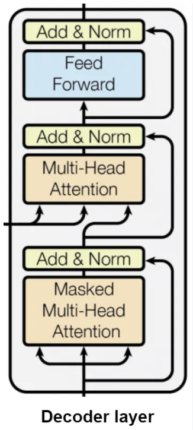

# Decoders Explained

  
   

Understand the transformer architecture by learning about decoders with detailed explanations on the architecture and a mini-project

# How to use

This repository is not made to use the code inside in itself, but as a summary of differents classes and papers you can find on the internet. It is a complete guide to understand the basics, but in details, of how decoders within the Transformer architecture work and how they can be used as a standalone architecture for certain tasks. 

You will find:

1. A explanations.ipynb notebook in which you will find all the information about decoders and their code implementation.

2. A mini-project folder in which you will find a code and a cleaner code for the implemenation of the decoder which can be called directly like a library

*If used alone to learn about decoders, I recommand to first check my other repository [[Encoders_Explained]](https://github.com/malerbe/Encoders_Explained)*

# References

## **Original Paper**
- Vaswani, A., et al. (2017). "Attention Is All You Need". *arXiv:1706.03762*. [[Paper]](https://arxiv.org/abs/1706.03762)

## **Video Resources**
- Hugging Face. (2022). "Transformer: decodeur". [[YouTube]](https://www.youtube.com/watch?v=d_ixlCubqQw)
- Machine Learning Studio. "A Dive Into Multihead Attention, Self-Attention and Cross-Attention". [[YouTube]](https://www.youtube.com/watch?v=mmzRYGCfTzc)
- Machine Learning Studio. "Self-Attention Using Scaled Dot-Product Approach". [[YouTube]](https://youtu.be/1IKrHh2X0F0?si=fQozjbfBRPw7J9p9)